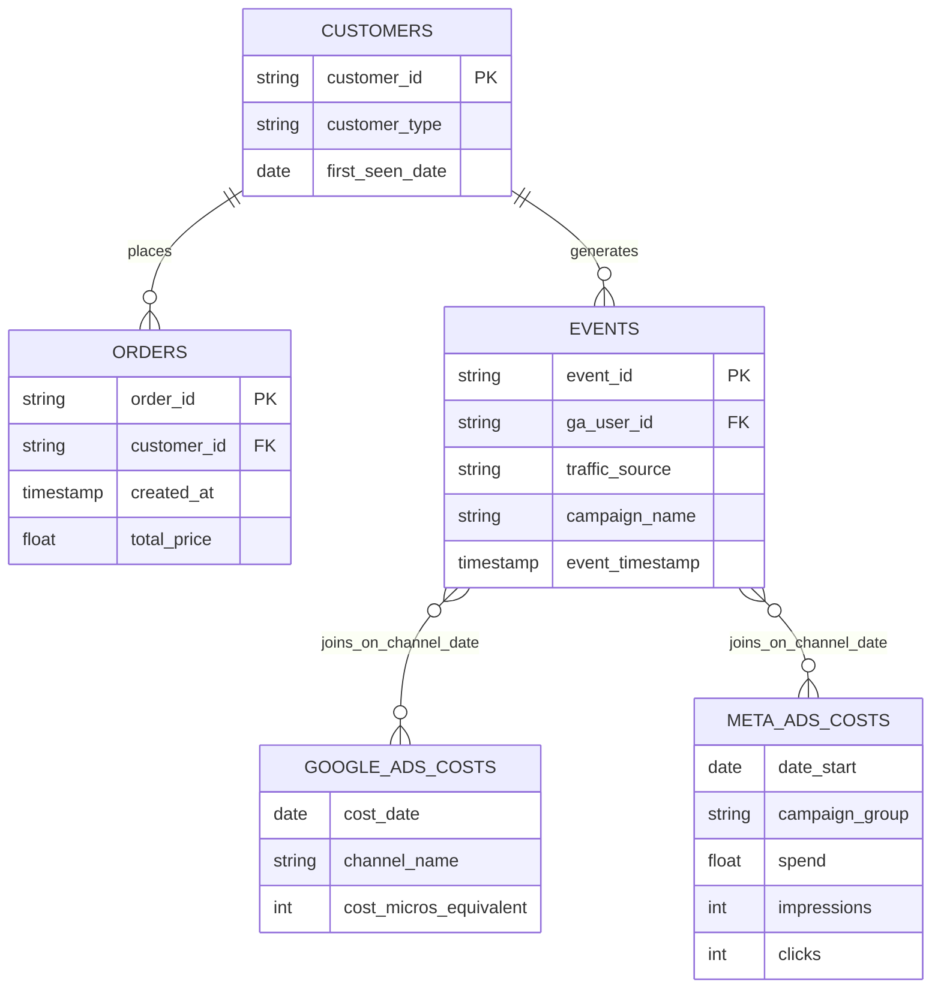
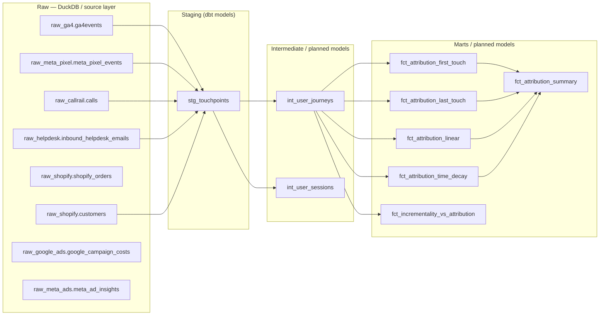

# Source schema

Entity relationship diagram of the five raw source tables and how they connect.

**Note on the cost tables:** `google_ads_costs` and `meta_ads_costs` don't share a customer or event key with anything else, they're daily aggregates. They join to `events` on `channel` + `date` instead, a many-to-many relationship, not a true foreign key. This is why `stg_costs` has to explicitly union and normalize both tables before "cost" becomes one consistent concept downstream.

---

## Layered schema view (raw → staging → intermediate → marts)

The diagram below shows the intended raw/staging/intermediate/mart architecture: how raw source tables (in DuckDB or a data warehouse) flow into per-source staging models, a canonical staging union (`stg_touchpoints`), intermediate journey stitching, and final attribution marts. Use this as a guide when organizing models and tests at each layer.

Notes:
- Raw: physical tables/files that arrive from source systems (DuckDB in dev, Snowflake/BigQuery in production). The current raw tables include the GA4, Meta Pixel, CallRail, Helpdesk, Shopify customer/order, and cost tables.
- Staging: your current dbt model in this repo is `stg_touchpoints`, which unifies the raw source tables used by the current project into one canonical touchpoint schema. The current implementation pulls from `raw_ga4.ga4events`, `raw_meta_pixel.meta_pixel_events`, `raw_callrail.calls`, `raw_helpdesk.inbound_helpdesk_emails`, and `raw_shopify.customers`.
- Intermediate: planned models such as `int_user_journeys` and `int_user_sessions` would sit here once implemented.
- Marts: planned attribution models such as `fct_attribution_first_touch`, `fct_attribution_last_touch`, `fct_attribution_linear`, `fct_attribution_time_decay`, `fct_attribution_summary`, and `fct_incrementality_vs_attribution` would sit here once implemented.

This layered view makes it clear where to place tests and transformations: schema tests on `stg_touchpoints` today, and business-rule tests on intermediate/mart models as those layers are built.