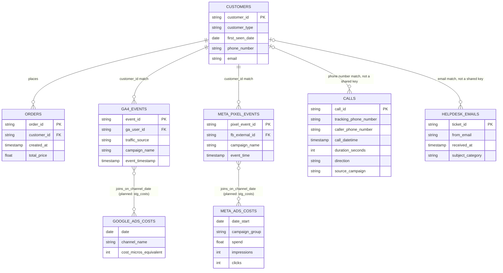
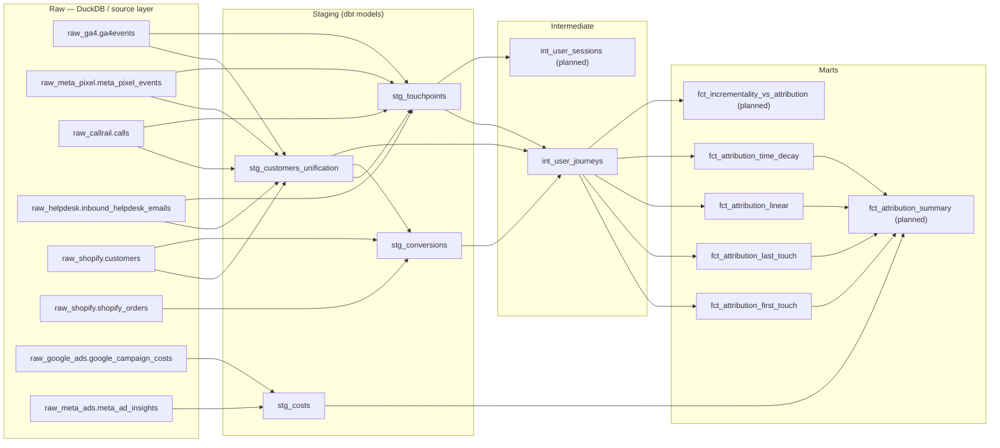

# Source schema

Entity relationship diagram of the eight raw source tables and how they connect.

**Note on identity matching:** `GA4_EVENTS` and `META_PIXEL_EVENTS` carry a customer ID directly (`ga_user_id`, `fb_external_id`), so they resolve to `CUSTOMERS` with a clean, if loosely-typed, key match. `CALLS` and `HELPDESK_EMAILS` carry no customer ID at all, they're matched to `CUSTOMERS` by a digit-normalized phone number or a lowercased/trimmed email address instead, a genuinely weaker join than a foreign key. `stg_customers_unification` is where all four of these matching strategies actually get implemented and reconciled into one `customer_profile_id`.

**Note on the cost tables:** `google_ads_costs` and `meta_ads_costs` don't share a customer or event key with anything else, they're daily aggregates. They join to touchpoints on `channel` + `date`, a many-to-many relationship, not a true foreign key. `stg_costs` normalizes both tables into one consistent "cost" concept (including converting Google Ads' cost-in-micros to standard currency); see the layered view below.

---

## Layered schema view (raw → staging → intermediate → marts)

The diagram below shows the raw/staging/intermediate/mart architecture: how raw source tables (in DuckDB, standing in for a data warehouse) flow into per-concern staging models, an intermediate journey model, and the (still-planned) attribution marts. Use this as a guide when organizing models and tests at each layer.

Notes:
- Raw: physical tables loaded directly into DuckDB by `build_source_data.py` (standing in for Snowflake/BigQuery in production), bypassing `dbt seed` entirely, the same way an EL tool would land them. Eight tables across seven schemas: `raw_ga4.ga4events`, `raw_meta_pixel.meta_pixel_events`, `raw_callrail.calls`, `raw_helpdesk.inbound_helpdesk_emails`, `raw_shopify.customers`, `raw_shopify.shopify_orders`, `raw_google_ads.google_campaign_costs`, `raw_meta_ads.meta_ad_insights`.
- Staging: four models are built and validated today. `stg_customers_unification` resolves the four touchpoint sources and the orders source against `raw_shopify.customers` into one `customer_profile_id` per person (see `docs/docs_data_methodology.md` for the matching logic). `stg_touchpoints` unions the four touchpoint sources into one canonical touchpoint schema, resolved against `stg_customers_unification`. `stg_conversions` normalizes `raw_shopify.shopify_orders` into a canonical conversions table, also resolved against `stg_customers_unification`. `stg_costs` normalizes the two cost sources, including the Google Ads micros conversion, into one canonical cost concept.
- Intermediate: `int_user_journeys` is built, it stitches every touchpoint before an order into a converting journey, and groups touchpoints from non-converting profiles into a non-converting journey, with ordinal position, time-since-previous-touch, and first/last-touch flags computed per touch. `int_user_sessions` is planned but not yet built.
- Marts: four attribution marts are built — `fct_attribution_first_touch`, `fct_attribution_last_touch`, `fct_attribution_linear`, and `fct_attribution_time_decay`. `fct_attribution_summary` (unions all four) and `fct_incrementality_vs_attribution` are still planned.

This layered view makes it clear where to place tests and transformations: schema and relationship tests on the staging layer (already in place for `stg_touchpoints`, `stg_conversions`, `stg_customers_unification`, `stg_costs`, and `int_user_journeys`), and business-rule tests on the mart layer as it gets built (not-null/unique tests already in place for the four built attribution marts).
